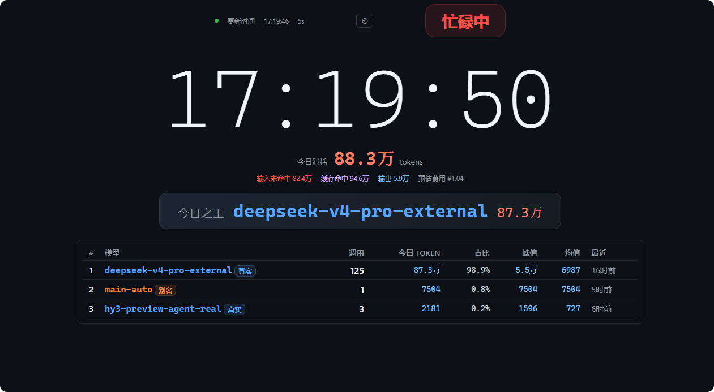
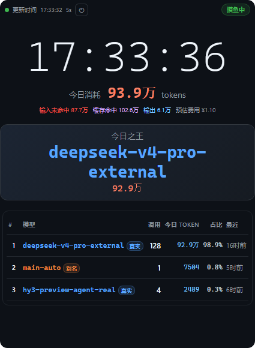

# MarvisTokensDashboard

Marvis AI 模型 Token 用量实时监控面板，单文件 Python HTTP 服务器，零外部依赖。

## 面板截图

**横屏（PC 端）**



**竖屏（手机端）**



## 快速开始

### 1. 配置用户 ID

编辑 `model_monitor.py` 第 10 行，将 `YOUR_USER_ID_HERE` 替换为你的 Marvis 用户 ID：

```python
DB_PATH = os.path.expandvars(
    r"%APPDATA%\Tencent\Marvis\User\YOUR_USER_ID_HERE\database\data.db"
)
```

其中`YOUR_USER_ID_HERE` 是要替换为你的用户 ID，实际为一串随机密文（比如`oAN1i2QeAp3l7N3rTulEfIYe4DDY`）。用户 ID 位于 `%APPDATA%\Tencent\Marvis\User\` 下的文件夹名，每个用户不同，需替换为自己的。

### 2. 配置 Python 路径（Windows）

编辑 `启动模型监控.bat`，将 `PYTHON_PATH` 改为你的 MarvisAgent 安装路径：

```bat
set PYTHON_PATH=C:\Program Files\Tencent\Marvis\MarvisAgent\VERSION_HERE\runtime\python311\python.exe
```

将 `VERSION_HERE` 替换为实际的版本号（如 `1.0.1100.210`）。Python 运行时随 MarvisAgent 打包安装，位于版本化安装目录下的 `runtime\python311\python.exe`。如果 MarvisAgent 安装在非默认路径，请改为实际路径。

### 3. 启动

双击 `启动模型监控.bat`，或在终端执行：

```bash
python model_monitor.py
```

浏览器访问 `http://127.0.0.1:19999`。

---

## 面板组件

| 组件 | 说明 |
|------|------|
| **状态徽章** | 绿色「摸鱼中」/ 红色「忙碌中」—— 每 5 秒轮询 `conversations` 表，近 2 分钟内有 `in_progress` 会话则显示忙碌 |
| **数字时钟** | 实时显示；夜间自动降至 45% 亮度（18:00~09:30 自动触发，也可手动点击 ☾ 按钮） |
| **今日消耗** | 净 Token 用量：输入未命中 + 缓存命中 + 输出 + 预估费用（按 DeepSeek 定价：输入 ¥1/百万、缓存 ¥0.1/百万、输出 ¥2/百万） |
| **冠军模型** | 今日 Token 消耗最高的模型，以「模型名 + Token 数（万）」展示 |
| **模型排行表** | 排名列表：模型名、调用次数、净 Token、占比、峰值/均值（单次请求）、最近调用时间。自动路由别名（以 `-auto` 结尾）单独标注 |

**模式切换**：点击顶栏 ◴ 按钮在 自动 / 夜间(☾) / 日间(☀) 三种模式间切换。

---

## 数据来源：`data.db`

面板读取 Marvis 本地 SQLite 数据库，路径为：

```
%APPDATA%\Tencent\Marvis\User\<USER_ID>\database\data.db
```

### 核心表：`llm_token_usage`

主要数据来源。每行为一次 LLM 响应的一个流式分块（chunk）。

| 字段 | 说明 |
|------|------|
| `usage_date` | 日期分区（YYYY-MM-DD） |
| `conversation_id` | 会话 ID |
| `response_id` | 响应 ID（同一响应对应多行，因流式输出产生多个 chunk） |
| `model_id` | 模型标识（如 `deepseek-v4-pro-external`、`main-auto`） |
| `input_tokens` | 输入 Token 数（本 chunk 累计值） |
| `output_tokens` | 输出 Token 数（累计值） |
| `thinking_tokens` | 思考/推理 Token 数 |
| `cached_tokens` | 缓存命中的输入 Token 数 |

**去重逻辑**：流式输出每次响应产生 6+ 个 chunk，面板通过取每个 `response_id` 的首个 chunk（MIN rowid）去重，再按 `(input_tokens - cached_tokens) + output_tokens` 汇总为净消耗。

### `conversations` 表

会话状态追踪。面板用 `status='in_progress'` 且 `updated_at` 在 2 分钟内的记录判定忙碌/空闲。

---

## data.db 中其他值得监控的表

以下表存在于 `data.db` 中，具备监控挖掘潜力：

| 表名 | 行数（参考） | 潜在监控用途 |
|------|-------------|-------------|
| **`agui_events`** | 181 万+ | 流式事件流 —— 可做实时 Agent 思考/动作流可视化、事件类型分布、延迟分析 |
| **`messages`** | 8,593 | 完整聊天记录（角色、内容、工具调用）—— 会话回放、提示词分析、工具使用模式统计 |
| **`approvals`** | 269 | 用户审批记录（工具名、状态、原因）—— 高风险操作审计、审批通过率分析 |
| **`products`** | 30 | 生成的产物文件（路径、名称、所属会话）—— 文件产出追踪、产物画廊 |
| **`agent_checkpoints`** | 316 | Agent 状态快照（BLOB）—— 检查点恢复、状态差异分析 |
| **`user_personas`** | 0 | 用户自定义 AI 人设档案 |

---

## 技术细节

- **服务器**：Python 标准库 `http.server` + `sqlite3`，零外部依赖
- **端口**：`19999`，绑定 `0.0.0.0`（局域网可访问）
- **刷新**：前端每 5 秒自动请求 `GET /api/stats`
- **计费**：按 DeepSeek 标准单价硬编码；如需适配其他模型，修改 `get_stats()` 中的 `PRICE_INPUT`/`PRICE_CACHED`/`PRICE_OUTPUT`
