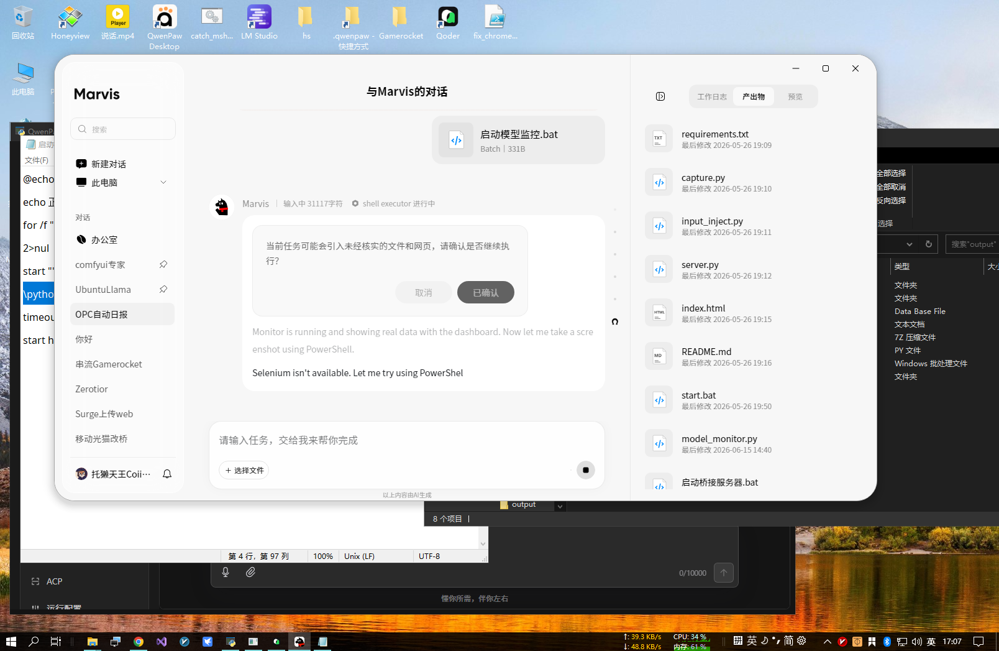

# MarvisTokensDashboard

Real-time dashboard monitoring Marvis AI model token usage and costs, served as a single-file Python HTTP server.



## Quick Start

### 1. Configure Your User ID

Edit `model_monitor.py` line 10, replace `YOUR_USER_ID_HERE` with your Marvis user ID:

```python
DB_PATH = os.path.expandvars(
    r"%APPDATA%\Tencent\Marvis\User\YOUR_USER_ID_HERE\database\data.db"
)
```

Your user ID can be found under `%APPDATA%\Tencent\Marvis\User\` — it's a folder named with a random alphanumeric string (e.g., `oAN1i2QeAp3l7N3rTulEfIYe4DDY`). The uploaded version uses `YOUR_USER_ID_HERE` as placeholder; each user must replace it with their own.

### 2. Configure Python Path (Windows)

Edit `启动模型监控.bat` and update `PYTHON_PATH` to match your MarvisAgent installation:

```bat
set PYTHON_PATH=C:\Program Files\Tencent\Marvis\MarvisAgent\VERSION_HERE\runtime\python311\python.exe
```

Replace `VERSION_HERE` with your actual MarvisAgent version (e.g., `1.0.1100.210`). The Python runtime is bundled with MarvisAgent — look under `runtime\python311\python.exe` in the versioned install directory.

### 3. Launch

Double-click `启动模型监控.bat`, or run:

```bash
python model_monitor.py
```

Open `http://127.0.0.1:19999` in your browser.

---

## Dashboard Components

| Panel | Description |
|-------|-------------|
| **Status Badge** | Green "Idle" / Red "Busy" — polls `conversations` table every 5s; switches to busy when any conversation is `in_progress` within the last 2 minutes |
| **Digital Clock** | Real-time display; dims to 45% brightness at night (auto 18:00-09:30 or manual via ☾ button) |
| **Today Consumption** | Net token usage: Input (cache miss) + Cache hit + Output + estimated cost in CNY (DeepSeek pricing: ¥1/M input, ¥0.1/M cached, ¥2/M output) |
| **Champion Model** | Top model by token consumption today, shown as "Model Name + Token Count" in Chinese 万 (10K) units |
| **Model Table** | Ranked list showing: model name, call count, net tokens, share %, peak/avg per request, last used time. Auto-routing aliases (ending `-auto`) are marked separately |

**Mode toggle**: Click ◴ to cycle between Auto / Night (☾) / Day (☀).

---

## Data Source: `data.db`

The dashboard reads from the Marvis local SQLite database located at:

```
%APPDATA%\Tencent\Marvis\User\<USER_ID>\database\data.db
```

### Key Table: `llm_token_usage`

The primary data source. Each row is a streaming chunk of a single LLM response.

| Column | Description |
|--------|-------------|
| `usage_date` | Date partition (YYYY-MM-DD) |
| `conversation_id` | Session ID |
| `response_id` | Response ID (multiple rows per response for streaming) |
| `model_id` | Model identifier (e.g., `deepseek-v4-pro-external`, `main-auto`) |
| `input_tokens` | Input tokens (cumulative in this chunk) |
| `output_tokens` | Output tokens (cumulative) |
| `thinking_tokens` | Thinking/reasoning tokens |
| `cached_tokens` | Cache-hit input tokens |

**Deduplication**: Streaming produces 6+ chunks per response. The dashboard deduplicates by taking only the first chunk (MIN rowid) per `response_id`, then sums `(input_tokens - cached_tokens) + output_tokens` as net consumption.

### `conversations` Table

Session state tracking. The dashboard uses `status='in_progress'` and `updated_at` within 2 minutes to determine busy/idle.

---

## Other Tables Worth Monitoring

These tables exist in `data.db` and are candidates for future dashboards:

| Table | Rows (sample) | Potential Use |
|-------|--------------|---------------|
| **`agui_events`** | 1.8M+ | Streaming event stream per conversation — could visualize real-time agent thought/action flows, event type distribution, latency analysis |
| **`messages`** | 8,593 | Full chat history (role, content, tool_calls) — conversation replay, prompt analysis, tool usage patterns |
| **`approvals`** | 269 | User approval records (tool_name, status, reason) — audit trail of dangerous operations, approval rate analytics |
| **`products`** | 30 | Generated file artifacts (path, name, conversation) — file output tracker, artifact gallery |
| **`agent_checkpoints`** | 316 | Agent state persistence (BLOB) — checkpoint restore, state diff analysis |
| **`user_personas`** | 0 | User-defined AI persona profiles |

---

## Technical Details

- **Server**: Python stdlib `http.server` + `sqlite3`, zero external dependencies
- **Port**: `19999`, binds `0.0.0.0` (accessible from LAN)
- **Refresh**: 5-second auto-poll via `GET /api/stats`
- **Pricing**: Hardcoded DeepSeek rates; adjust `PRICE_INPUT`/`PRICE_CACHED`/`PRICE_OUTPUT` in `get_stats()` for other providers
